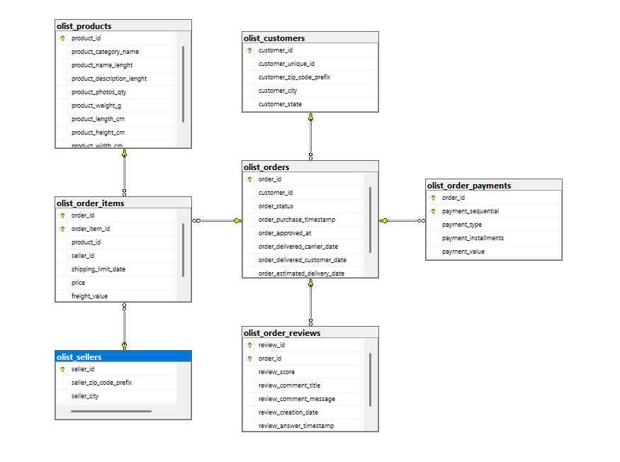

# "What drives customer satisfaction on Olist marketplace?"

## Project Overview

This project explores the main factors that influence customer satisfaction on the Olist marketplace. The analysis focuses on customer reviews, order delivery performance, payment behavior, products, sellers, and geographic information.

The main business question is:

__What drives customer satisfaction on the Olist marketplace?__

The goal of the project is to identify patterns connected with higher and lower review scores and translate them into business insights.

## Data source

The project uses the publicly available Brazilian E-Commerce Public Dataset by Olist. The dataset consists of multiple CSV files containing information about orders, customers, sellers, products, payments, reviews, and delivery status.

## Database Creation

The first step was to create a relational database in MS SQL Server.

`CREATE DATABASE Olist;`

After creating the database, I imported the CSV files as flat files into SQL Server. Then, I reviewed the structure of each table, checked column names, data types, and potential key columns.

Some data types were not assigned correctly during the import process, so I manually adjusted them where needed. After that, I started defining primary keys and foreign key relationships between tables.

## Initial Data Structure Check

I began by previewing the imported tables:

```
SELECT TOP 10 * FROM dbo.olist_customers; 
SELECT TOP 10 * FROM dbo.olist_orders; 
SELECT TOP 10 * FROM dbo.olist_order_items; 
SELECT TOP 10 * FROM dbo.olist_order_payments; 
SELECT TOP 10 * FROM dbo.olist_order_reviews; 
SELECT TOP 10 * FROM dbo.olist_products; 
SELECT TOP 10 * FROM dbo.olist_sellers;
```

This helped me understand the structure of the dataset and identify the main entities used in the project.

## Primary Keys and Data Quality Checks

While assigning primary keys, I discovered an anomaly in the dbo.olist_order_reviews table. The review_id column was not sufficient as a standalone unique identifier in every case.

Because of that, I treated the reviews table more carefully and investigated whether a composite key based on review_id and order_id would better represent the structure of the data.

This issue will be further explored during the EDA phase of the project, especially because customer reviews are central to the main research question.

## Relational Database Model

After reviewing the tables, I created relationships between them based on the dataset structure.

The main relationships include:

- customers connected to orders through customer_id,
- orders connected to order items through order_id,
- orders connected to payments through order_id,
- orders connected to reviews through order_id,
- order items connected to products through product_id,
- order items connected to sellers through seller_id,
- products connected to product category translations through product_category_name.

The database schema is shown below:



## Data profiling

 1. dbo.olist_orders
